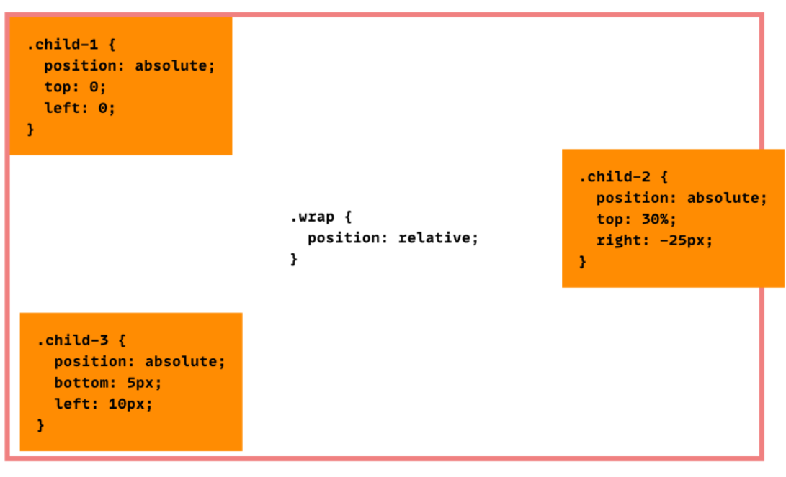

## repositorio del curso platiCSS

aca subo lo que realizo en los cursos de platzi sobre CSS

### pseudo clases

Una pseudo clase es un estado del elemento, clickeado, click, visitado, encima la pseudo clase link, modifica aquellos links no visitados.

ejemplos: :hover, :link, :visited, :not

### pseudo elementos

los pseudo elementos no son como las pseudo clases que describen un estado del elemento, sino que modifican el elemento.

ejemplos: ::before, ::after

## paginas interesantes:

te muestra las funciones de timing
https://easings.net/#

https://angrytools.com/css-generator/transform/

https://divtable.com/table-styler/
https://html-css-js.com/css/generator/box-shadow/

gradientes bonitos y faciles
https://cssgradient.io/gradient-backgrounds/

entender el funcionamiento de

```bash
perspective-origin
```

es animado!:
https://developer.mozilla.org/en-US/docs/Web/CSS/perspective-origin

transformaciones (ej:rotacion) desde otro punto de origen:

https://cssreference.io/property/transform-origin/

http://css3studio.com/page-css3/css-transform.php

# posicionamiento de elementos

explicacion general:

https://css-tricks.com/absolute-relative-fixed-positioining-how-do-they-differ/

en este se explica una situacion curiosa y muy usada el padre es relativo y el hijo es absoluto.
esto hace que el hijo se posicione segun donde este el padre.

https://css-tricks.com/absolute-positioning-inside-relative-positioning/

## sobre transition

la transicion es una propiedad css, que nos permite animar un cambio declarado en una pseudo-clase, para esto requiere decir que propiedad es la que esta siendo animada (no todas son animables). y luego decir la duracion.

## Tips UX

### movimiento impulsado por la accion

cuando hacemos hover si tardamos 1s cuando salimos deberiamos tardar un poquito mas.

### tiempos de espera

imaginante navengado por categorias desplegables en el headbar de la pagina, mientras vas navengado se desplega otra categoria y te saliste de la caja un cachito y se cerro de golpe. esto es feo.
es bueno implementar tiempo de esperas para estas cosas.

## performance

al momento de hacer animaciones, el navegador tiene que realizar hasta 3 actividades
layout, paint, y composite.
mas informacion sobre esto aqui:

https://hacks.mozilla.org/2017/08/inside-a-super-fast-css-engine-quantum-css-aka-stylo/

resumen:
layout= si la propiedad cambia el tamaño del elemento y esto afecta al posicionamiento o tamaño de otros elementos.
paint= cambia el color, o hay que generar capas de solapamiento
composite= ni idea. ej que solo usan composite= opacity, transform.

layout->paint->composite.
si usas composite no genera el resto y es muy eficiente.

aqui tenes una tabla con todas las propiedades y su rendimiento.

https://csstriggers.com/
